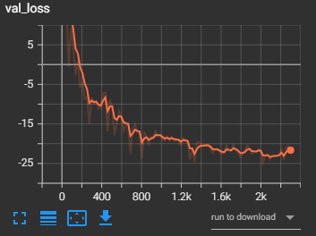
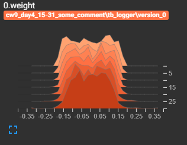
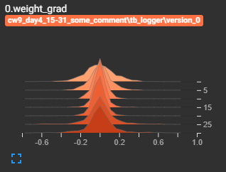
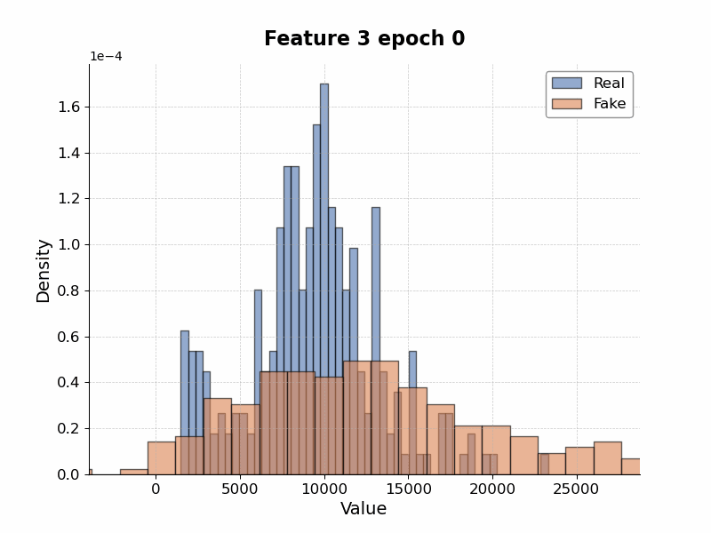
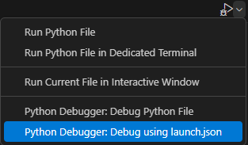

# Tabular Data Generation


<!-- Images in a row -->
<p align="center">
  
  
  
  
</p>

This project serves as an example ML / DL project for tabular data generation. It takes at the basis the approach of
[CTGAN and TVAE](https://github.com/sdv-dev/CTGAN) and improves the framework in follwoing context:

- The data transformer is saved and reused for the data, if not requested differently
- Framework rewritten in PyTorch Lightning -> more flexible and easily manageble
- Implemented the Tensorboard pluggin to visualize the training processes

# Data

An example dataset will be used for the data generation pipeline. The dataset is taken from one of the most popular kaggle challanges: [Housing Prices competition](https://www.kaggle.com/competitions/home-data-for-ml-course/data). Download and put it into the folder `data`.

# Environment

Create environment as follows:

```
conda env create -f environment.yml
```

After the environment is installed you can activate it:

```
conda activate gen-tab-env
```
# Usage

You need to firstly setup the information in **conf/generation_config.yaml** considering the path tou your data.

Afterwards you can run a training of the variational autoencoder as follows

```
python -m scripts.train --model-type=[model]
```

while acceptable `[model]` is either `vae` (default) or `gan`. Or use the created setup for VSCode Debug (see the image below).
<p align="left">
  
</p>

See `--help` for more information

```
Usage: python -m scripts.train [OPTIONS]

Options:
  --model-type TEXT   Type of model to train. Either 'vae' (default) or 'gan'.
  --resume-from TEXT  If you want to resume training from a checkpoint,
                      provide the path to the checkpoint.
  --help              Show this message and exit.
```

# Tensorboard


To run tesorboard visualizing your algorithms use Tensorboard Extension in VSCode or run 

```
python -m tensorboard.main --logdir [logdir name]  --samples_per_plugin "images=100"
```


If you want to specialize specific blocks of your architecture, including their histomgrams, weights and gradients please edit them in [tb_settings.yaml](https://github.com/mackostya/gen-tab/blob/main/conf/tb_settings.yaml). Add them to `parameters_to_visualize`.


# Detailed Description of the Repository

The training workflow is implemented using PyTorch Lightning. Below is a description of the individual modules:

- `conf/`
  - `conf/generation_config.yaml` – Describes the model hyperparameters, the data path, and the checkpoint path.
  - `conf/tb_settings.yaml` – Specifies the settings for logging with TensorBoard.
- `docs/` – Contains important documents, such as the CTGAN License.
- `scripts/`
  - `scripts/train.py` – Script for training the models.
  - `scripts/generate.py` – <span style="color:red;">Work in Progress</span>.
- `src/`
  - `src/[model]/` – Implementation of the training procedures and architecture for each model.
    - `src/[model]/loop.py` – **PyTorch Lightning** loop. Each loop inherits from `L.LightningModule` to leverage all the functionalities provided by Lightning for training and from `ModelInterface` for TensorBoard logging and checkpoint management.
    - `src/[model]/model/` – Model-specific blocks and functions (e.g., *Encoder*, *Decoder*, *Discriminator*, *Generator*, etc.).
  - `src/factory.py` – Generalizes model creation using the factory design pattern. For more details, see [this article](https://www.geeksforgeeks.org/factory-method-python-design-patterns/).
  - `src/interface.py` – Provides a model interface with general logging functions used across all models.
  - `src/visualizations.py` – Contains `matplotlib` visualizations used in the repository.
  - `src/tools.py` – Includes various utility functions used throughout the repository.
